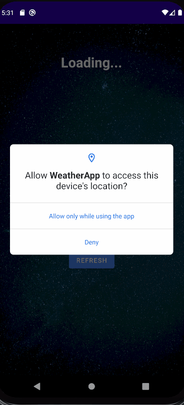

## Weather App (Android | Java)

### This application gets weather info from **openweathermap** for the user's current location

#### Instructions to use:
1) Open project in IDE (Android Studio recommended)
2) Ensure app/src/main/assets/application.properties contains your API key for **openweathermap**
* For example if your API Key is "xyz123",
  replace API_KEY=yourapikeyhere
  with API_KEY=xyz123
3) Sync, Build and run

* If you have any queries, please feel free to reach out arshad.sbsa@gmail.com

#### Testing:
* UiUtilTest.java (test)
* TestPropertyUtil.java (androidTest)

#### Usage:

